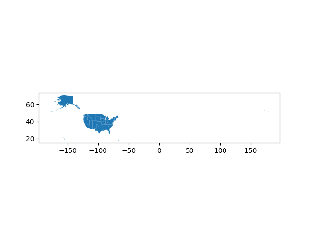
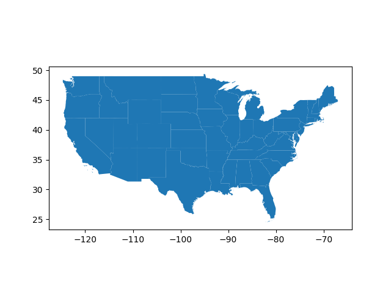
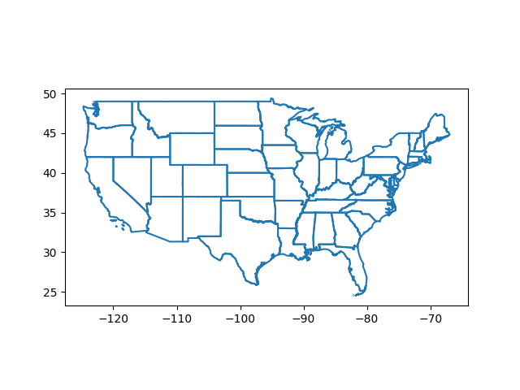
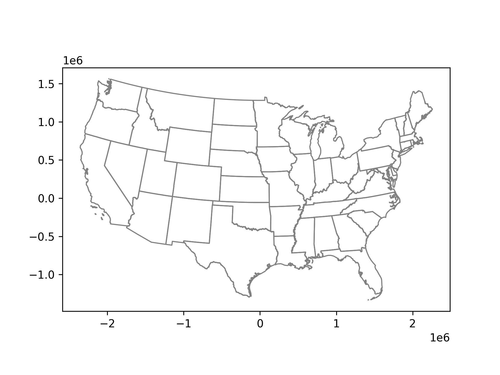
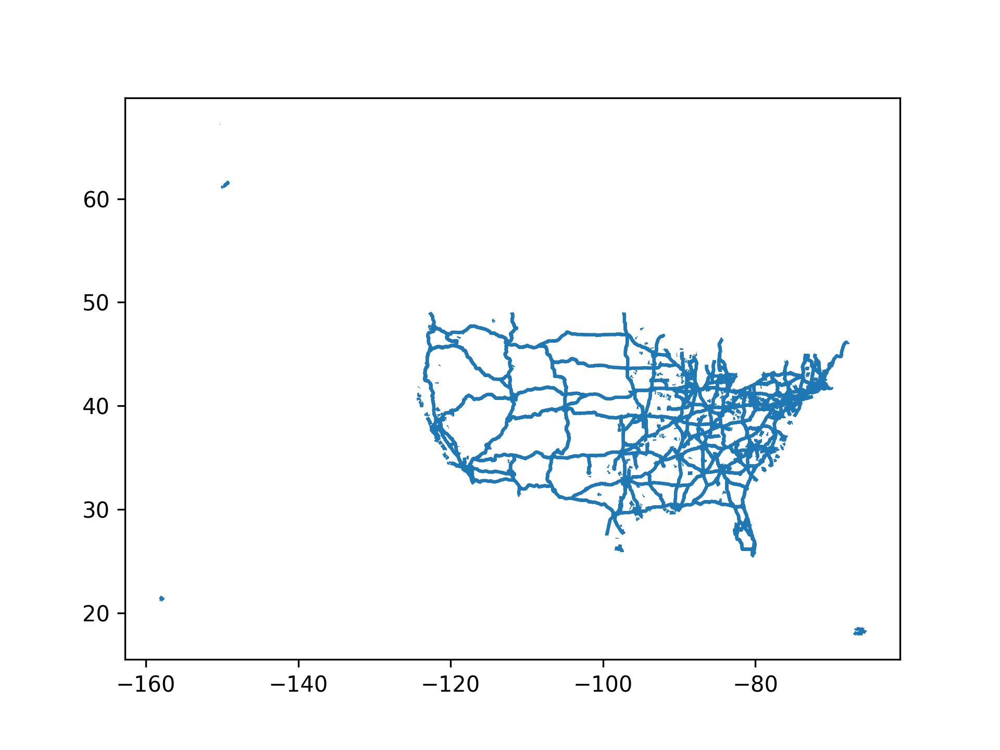
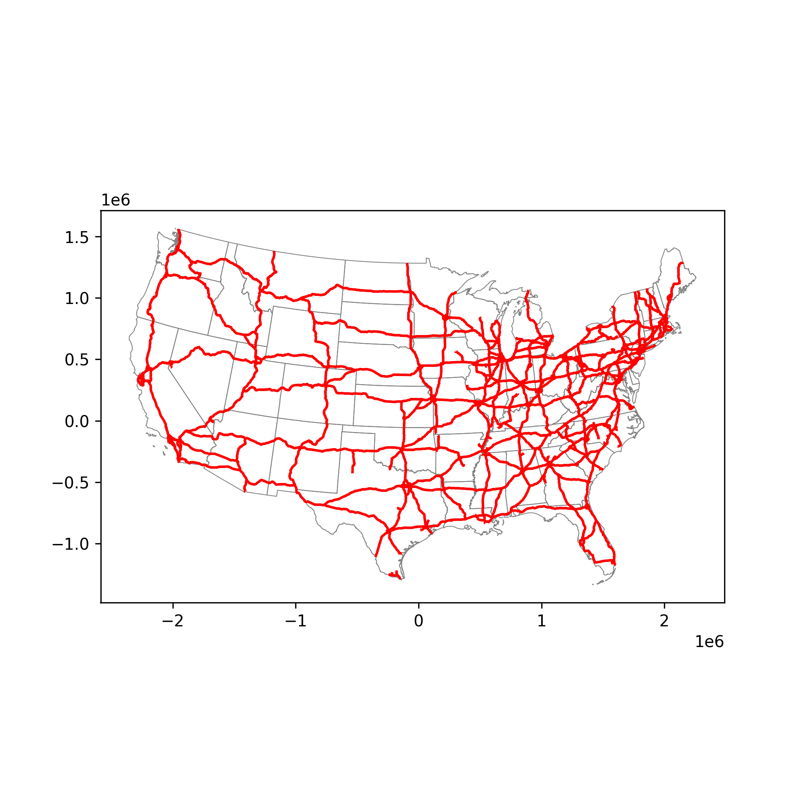
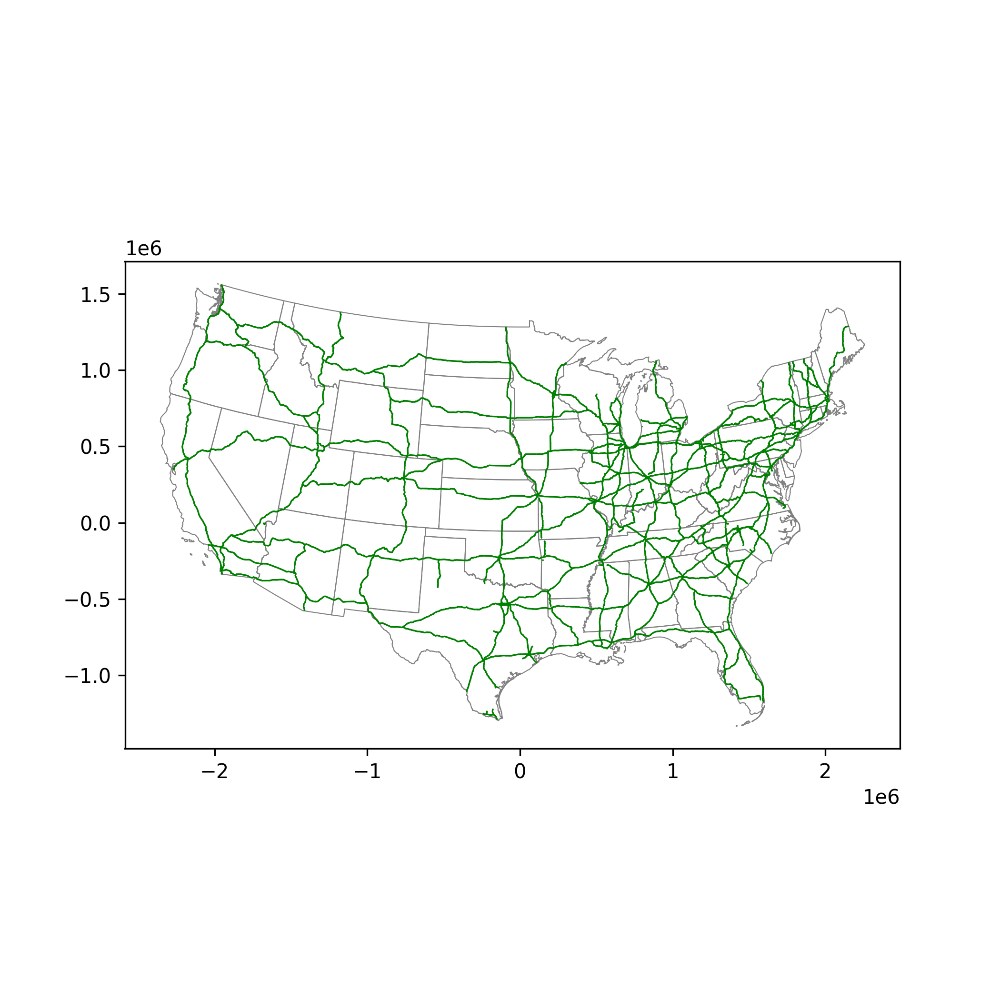
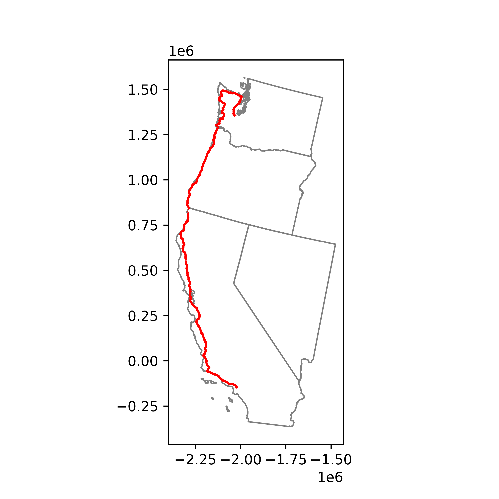

####  0.  Geopandas and matplotlib

US state data at 5m is in a shapefile ``'data/gz_2010_us_040_00_5m'``.

After the imports (see the script below) do

```
>>> us = gpd.read_file('data/gz_2010_us_040_00_5m')
>>> us.columns
Index(['GEO_ID', 'STATE', 'NAME', 'LSAD', 'CENSUSAREA', 'geometry'], dtype='object')
>>> us.head()
        GEO_ID  ...                                           geometry
0  0400000US01  ...  MULTIPOLYGON (((-88.12466 30.28364, -88.08681 ...
1  0400000US02  ...  MULTIPOLYGON (((-166.10574 53.98861, -166.0752...
2  0400000US04  ...  POLYGON ((-112.53859 37.00067, -112.53454 37.0...
3  0400000US05  ...  POLYGON ((-94.04296 33.01922, -94.04304 33.079...
4  0400000US06  ...  MULTIPOLYGON (((-122.42144 37.86997, -122.4213...

[5 rows x 6 columns]
>>>
```

The 52 rows are U.S. states plus the ``District of Columbia`` and also ``Puerto Rico``.  

``us['STATE']`` are FIPS codes, ``us['NAME']`` are what we expect.


```
>>> us.plot()
```

I'm on macOS.  Up pops a fancy icon I've never seen in the Dock.  It has the label Python.


Presumably this is for a Python GUI but I'm missing something which is needed to make it work.

**script0.py**:

```
import matplotlib.pyplot as plt
import geopandas as gpd

us = gpd.read_file('data/gz_2010_us_040_00_5m')
fig = us.plot()
plt.savefig('example0.png')
```

I get a cute little map of all 50 US states + Puerto Rico.



Latitude is about 15-70 (north), but longitude is the whole range.

I wasn't able to figure out how to crop the plot yet.

The fig is an object of class AxesSubplot (from matplotlib).  I tried getting the axes and doing ``setxlim``, ``setylim`` but it does not work.

```
>>> ax = plt.axes()
>>> ax.set_xlim()
(0.0, 1.0)
>>> ax.set_ylim()
(0.0, 1.0)
>>>
```

#### 1. Filtering

Geopandas data frames have something ``.cx``.  It is called in the following way:

```
xmin,ymin,xmax,ymax = -124.9,25.02,-66.74,49.1
coast = coast.cx[xmin:xmax, ymin:ymax]
```

I determined the bounds of the continental United States by hand using Google Maps.  I got ``xmin,ymin,xmax,ymax = -124.9,25.02,-66.74,49.1``.


Adding this

**script1.py**:

```
import matplotlib.pyplot as plt
import geopandas as gpd

us = gpd.read_file('data/gz_2010_us_040_00_5m')
xmin,ymin,xmax,ymax = -124.9,25.02,-66.74,49.1
lower48 = us.cx[xmin:xmax, ymin:ymax]

fig = lower48.plot()
plt.savefig('example1.png')
```



#### 2.  Plot only the boundary.

**script2.py**:

```
import matplotlib.pyplot as plt
import geopandas as gpd

us = gpd.read_file('data/gz_2010_us_040_00_5m')
xmin,ymin,xmax,ymax = -124.9,25.02,-66.74,49.1
lower48 = us.cx[xmin:xmax, ymin:ymax]

fig = lower48.boundary.plot()
plt.savefig('example2.png')
```



#### 3. CRS: coordinate reference system.

It's not one of the columns, but the Geopandas data frame has associated with it a CRS.

```
>>> us = gpd.read_file('data/gz_2010_us_040_00_5m')
>>> us.crs
<Geographic 2D CRS: EPSG:4269>
Name: NAD83
Axis Info [ellipsoidal]:
- Lat[north]: Geodetic latitude (degree)
- Lon[east]: Geodetic longitude (degree)
Area of Use:
- name: North America - onshore and offshore: Canada - Alberta; British Columbia; Manitoba; New Brunswick; Newfoundland and Labrador; Northwest Territories; Nova Scotia; Nunavut; Ontario; Prince Edward Island; Quebec; Saskatchewan; Yukon. Puerto Rico. United States (USA) - Alabama; Alaska; Arizona; Arkansas; California; Colorado; Connecticut; Delaware; Florida; Georgia; Hawaii; Idaho; Illinois; Indiana; Iowa; Kansas; Kentucky; Louisiana; Maine; Maryland; Massachusetts; Michigan; Minnesota; Mississippi; Missouri; Montana; Nebraska; Nevada; New Hampshire; New Jersey; New Mexico; New York; North Carolina; North Dakota; Ohio; Oklahoma; Oregon; Pennsylvania; Rhode Island; South Carolina; South Dakota; Tennessee; Texas; Utah; Vermont; Virginia; Washington; West Virginia; Wisconsin; Wyoming. US Virgin Islands. British Virgin Islands.
- bounds: (167.65, 14.92, -40.73, 86.45)
Datum: North American Datum 1983
- Ellipsoid: GRS 1980
- Prime Meridian: Greenwich
- 
>>> 
```

Without worrying too much, we'll just remember that the actual earth is an oblate spheroid, so a projection of some kind is required to produce a 2D map.

I like the [Albers](https://en.wikipedia.org/wiki/Albers_projection) projection.

The ESRI version is called 102003.  According to [this](https://epsg.io/102003) 

```
["latitude_of_center",37.5],
["longitude_of_center",-96],
["standard_parallel_1",29.5],
["standard_parallel_2",45.5],
```

This is only slightly different than what we used elsewhere, which had the centroid at latitude 23.0.  I don't remember why this was chosen, it is the approximate latitude of Mazatlan, Sinaloa, Mexico.

**script3.py**:

```
import matplotlib.pyplot as plt
import geopandas as gpd

us = gpd.read_file('data/gz_2010_us_040_00_5m')
xmin,ymin,xmax,ymax = -124.9,25.02,-66.74,49.1
lower48 = us.cx[xmin:xmax, ymin:ymax]

albers = lower48.to_crs("ESRI:102003")
albers.boundary.plot(color='gray', linewidth=1)

plt.savefig('example3.png', dpi=300)
```




####  4.  Working with highway data

I have highway data as a shapefile in ``'data/tl_2019_us_primaryroads'``.  This is the same data I've been working with all along.

```
>>> import geopandas as gpd
>>> import matplotlib.pyplot as plt
>>> 
>>> highways = gpd.read_file('data/tl_2019_us_primaryroads')
>>> 
>>> fig = roads.plot()
>>> plt.savefig('example.png', dpi=300)
>>>
```

It gives a nice sharp map of the highways.  



The map illustrates why the search for US Hwy 101 and 285
gives such poor results.  The US Highway data is almost entirely missing from "primaryroads".

Notice that it includes AK, HI and PR.  The coastline is also missing.  We'll fix that in the last section.

#### 5.  Combining layers

The next task is to filter out highways in the 'lower 48'
and trace just the US coastline, combined into a single figure.

**script5.py**:

```
import matplotlib.pyplot as plt
import geopandas as gpd

states = gpd.read_file('data/gz_2010_us_040_00_5m')
roads = gpd.read_file('data/tl_2019_us_primaryroads')

xmin,ymin,xmax,ymax = -124.9,25.02,-66.74,49.1
us48 = states.cx[xmin:xmax, ymin:ymax]

roads = roads.cx[xmin:xmax, ymin:ymax]
interstates = roads[roads['RTTYP'] == 'I']

def albers(df):
    return df.to_crs("ESRI:102003")

fig, ax = plt.subplots(figsize=(7,7))
albers(us48).boundary.plot(
    ax=ax, color='gray', linewidth=0.5)
albers(interstates).plot(
    ax=ax, color='red', linewidth=1.5)

plt.savefig('example5.png', dpi=300)
```



#### 6.  Filtering for major interstates

The general idea for filtering a data frame in pandas or Geopandas is to build a selector which is a ``Series`` of boolean values.  

But actually a plain Python list will do.  Then it's just

```
df = df[SEL]
```
The application is that I want to filter to keep only the major interstates, defined as those whose numeric designation is two digits (or one).

The problem is that the 'FULLNAME' data is messy.  It has HOV designations and other crazy stuff.

Here's a Python function that takes apart a single fullname and returns a boolean.

```
def process(e):
    def get_digits(s):
        return [c for c in s if c in '0123456789']
    rL = reversed(e.split())
    for s in rL:
        sL = get_digits(s)
        if s != []:
            num = ''.join(sL)
            return len(num) <= 2
    return False
```

With that defined, all we need to to do is:

```
df = df[df['RTTYP'] == 'I']
SEL = [process(e) for e in list(df['FULLNAME'])]
majors = df[SEL]
```

Here's the result:



and the script

**script6.py**:

```
def albers(df):
    return df.to_crs("ESRI:102003")

def process(e):
    def get_digits(s):
        return [c for c in s if c in '0123456789']
    rL = reversed(e.split())
    for s in rL:
        sL = get_digits(s)
        if s != []:
            num = ''.join(sL)
            return len(num) <= 2
    return False

import geopandas as gpd
import matplotlib.pyplot as plt

fn = 'data/tl_2019_us_primaryroads'
df = gpd.read_file(fn)

states = gpd.read_file('data/gz_2010_us_040_00_5m')

xmin,ymin,xmax,ymax = -124.9,25.02,-66.74,49.1
df = df.cx[xmin:xmax, ymin:ymax]
us48 = states.cx[xmin:xmax, ymin:ymax]

df = df[df['RTTYP'] == 'I']
SEL = [process(e) for e in list(df['FULLNAME'])]
majors = df[SEL]
    
fig, ax = plt.subplots(figsize=(7,7))
albers(us48).boundary.plot(
    ax=ax, color='gray', linewidth=0.5)
albers(majors).plot(
    ax=ax, color='green', linewidth=0.75)

plt.savefig('example6.png', dpi=300)
```

#### 7.  Adding a column with a better name.

I rewrote ``process`` to return a 'SHORTNAME' rather than a boolean value.

```
def process(e):
    def get_digits(s):
        return [c for c in s if c in '0123456789']
    rL = reversed(e.split())
    for s in rL:
        sL = get_digits(s)
        if s != []:
            num = ''.join(sL)
            return 'I-' + num        
    return ''
```

Then, the rest of the script is

**script7.py**

```
import geopandas as gpd
import matplotlib.pyplot as plt
fn = 'data/tl_2019_us_primaryroads'
df = gpd.read_file(fn)

df = df[df['RTTYP'] == 'I']

fullnames = list(df['FULLNAME'])
L = [process(e) for e in fullnames]
df.insert(0, 'SHORTNAME', L)

SEL = [3 <= len(e) <= 4 for e in L]
majors = df[SEL]
print(majors.head())
```

This prints:

```
> p3 script7.py
     SHORTNAME  ...                                           geometry
452       I-20  ...  LINESTRING (-98.10768 32.61152, -98.10606 32.6...
453       I-20  ...  LINESTRING (-98.97077 32.37467, -98.97174 32.3...
1005      I-26  ...  LINESTRING (-82.32578 36.29558, -82.32557 36.2...
1006      I-26  ...  LINESTRING (-80.98357 33.77849, -80.98277 33.7...
1007      I-26  ...  LINESTRING (-82.39353 36.16997, -82.39374 36.1...

[5 rows x 6 columns]
>
```

#### Save the data.

**script8.py**

```
def process(e):
    def get_digits(s):
        return [c for c in s if c in '0123456789']
    rL = reversed(e.split())
    for s in rL:
        sL = get_digits(s)
        if s != []:
            num = ''.join(sL)
            return 'I-' + num        
    return ''
    
import geopandas as gpd
import matplotlib.pyplot as plt

fn = 'data/tl_2019_us_primaryroads'
df = gpd.read_file(fn)

df = df[df['RTTYP'] == 'I']

fullnames = list(df['FULLNAME'])
L = [process(e) for e in fullnames]

# here's the new column inserted in front
df.insert(0, 'SHORTNAME', L)

# and here's the filter for major interstates
SEL = [3 <= len(e) <= 4 for e in L]
majors = df[SEL]

# just for fun
majors = majors.to_crs("ESRI:102003")

ofn = 'major_interstates.shp.zip'
majors.to_file(
    filename=ofn, 
    driver='ESRI Shapefile')

# see if it loads
ifn = ofn
df = gpd.read_file(ifn)
print(df.head())

# not quite sure how to handle a CRS object yet
print(str(df.crs)[:65])
```

This prints:

```
> p3 script8.py
  SHORTNAME  ...                                           geometry
0      I-20  ...  LINESTRING (-196683.660 -544653.630, -196530.4...
1      I-20  ...  LINESTRING (-278027.372 -568900.488, -278118.6...
2      I-26  ...  LINESTRING (1212687.246 -47547.967, 1212711.39...
3      I-26  ...  LINESTRING (1375086.747 -307694.542, 1375171.9...
4      I-26  ...  LINESTRING (1208727.809 -62335.176, 1208711.88...

[5 rows x 6 columns]
PROJCS["USA_Contiguous_Albers_Equal_Area_Conic",GEOGCS["NAD83",DA
>
```

#### Assembling US Hwy 101

Here's the result:



And here's the script, in two parts:

**script9a.py**

```
# scrape data for US Hwy 101 in CA-NV-WA
# CA fips = 06, OR = 41, WA = 53

import geopandas as gpd
import pandas as pd

fipsD = {'CA':'06', 'OR':'41', 'WA':'53'}

template = 'data-us_highways/tl_2020_%s_prisecroads.zip'

# --------------------------------

alt_names =  ['US Hwy 101'
              'US Hwy 101 Bus',
              'US Hwy 101 N',
              'US Hwy 101N']

def get_highway(state, hwy):
    fn = template % fipsD[state]
    df = gpd.read_file(fn)
    
    L = list()
    # note: would not allow a list of boolean as selector
    # why different this time?
    for name in alt_names:
        sub = df[df['FULLNAME'] == name]
        L.append(sub)
    us101 = pd.concat(L)    
    return us101

us101ca = get_highway(state='CA', hwy='US Hwy 101')
us101or = get_highway(state='OR', hwy='US Hwy 101')
us101wa = get_highway(state='WA', hwy='US Hwy 101')

us101 = pd.concat([us101ca,us101or,us101wa])

ofn = 'us101.shp.zip'
us101.to_file(
    filename=ofn,
    driver='ESRI Shapefile')
```

**script9b.py**

```
import matplotlib.pyplot as plt
import geopandas as gpd

us_data = gpd.read_file('data/gz_2010_us_040_00_5m')
us101 = gpd.read_file('data-us_highways/us101.shp.zip')

xmin,ymin,xmax,ymax = -125,32,-120,49
CA_OR_WA = us_data.cx[xmin:xmax, ymin:ymax]

# --------------------------------

fig, ax = plt.subplots(figsize=(5,5))

def albers(df):
    return df.to_crs("ESRI:102003")
    
def plot_outline(df):
    df = albers(df)
    df.boundary.plot(
        ax=ax, color='gray', linewidth=1)

plot_outline(CA_OR_WA)

# --------------------------------

albers(us101).plot(
    ax=ax, color='red', linewidth=1.5)

plt.savefig('example9.png', dpi=600)
```